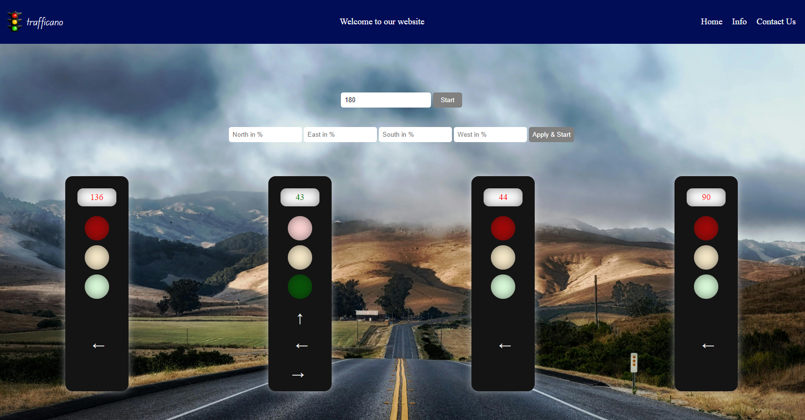
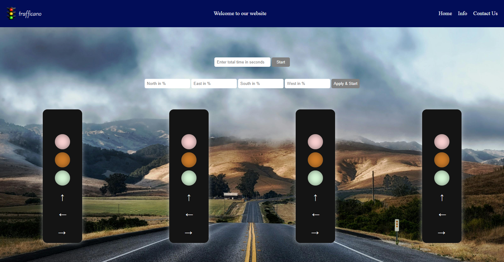

# Traffic-signal

 4 side traffic signal made with javascript

 

You can also decide how many times a day the team signals on a rush day

You can also set the team according to your preference in given field

This is another photo of the signal off